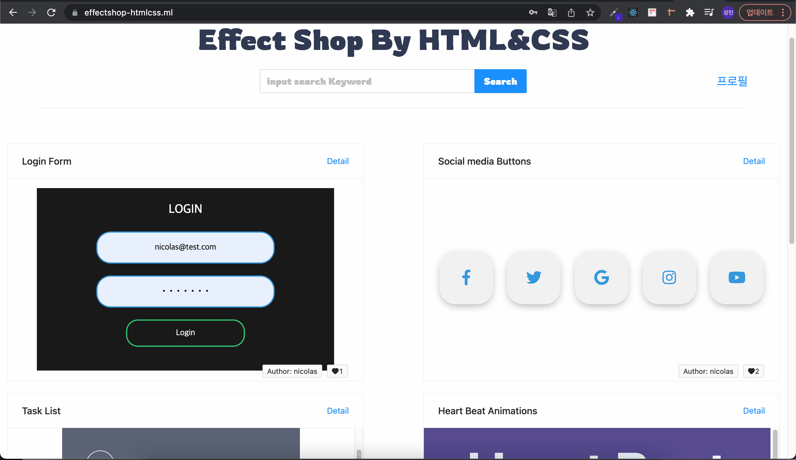

# effectShopByHTML-CSS

  
## 프로젝트 주제

HTML과 CSS 를 배운지 얼마 안된 초보개발자분 들에게 조금이라도 도움이되고자. HTML과CSS 들로만 만들 수 있는 훌륭한 효과들을 모아놓고 해당 이펙트 의 소스코드도 보면서 공부할 수 있습니다. 자기가 만든 이펙트를 해당 사이트에 올리셔서 공유도 가능합니다.

## 사이트주소: https://effectshop-htmlcss.ml

### 프로젝트 관한 작은기록들 https://velog.io/@sungmin-choi/series/%ED%94%84%EB%A1%9C%EC%A0%9D%ED%8A%B8Effect-Shop

### 사용한기술

- Front-end
  React.js, Next.js, Redux,Redux-saga, Style-components
- Back-end
  Node.js, Express
- Database
  Mysql, Sequelize
- Deployment
  AWS(Ec2,Route53) Nginx

## 프로젝트 기능 및 구성

- 로그인 페이지
  - github 소셜로그인/회원가입
  - local 로그인
- 회원가입 페이지
  - github 소셜로그인/회원가입
  - local 이메일 회원가입
- 메인페이지
  - 업로드 최신순으로 이펙트 나열
  - 무한스크롤 기능 구현
  - 이펙트에게 좋아요 기능 구현
  - 키워드 검색으로 원하는 이펙트 검색 기능
- 개인 프로필 페이지
  - 간단한 자기정보(이름, 이메일)
  - 로그아웃 기능
  - 이펙트 업로드기능 구현
  - 자신이 업로드한 이펙트 삭제, 수정 기능 구현
